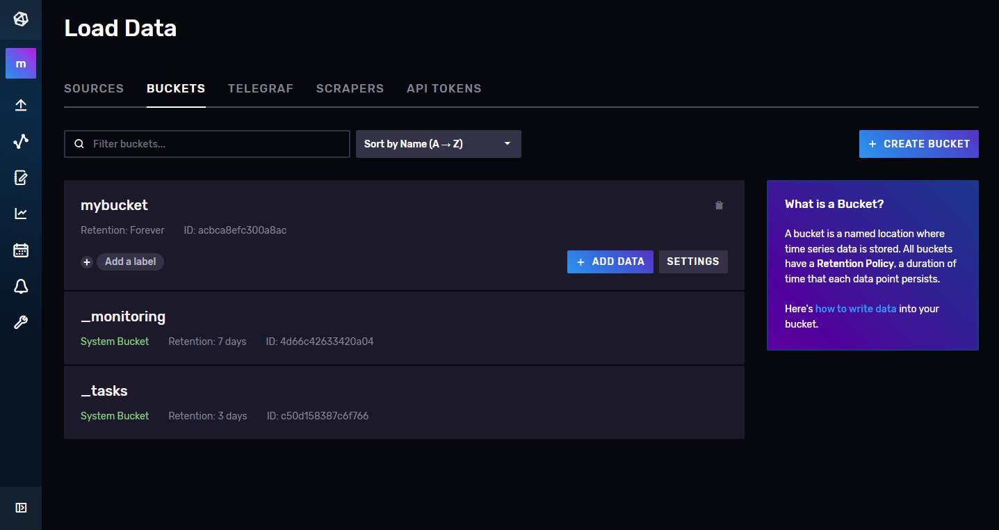
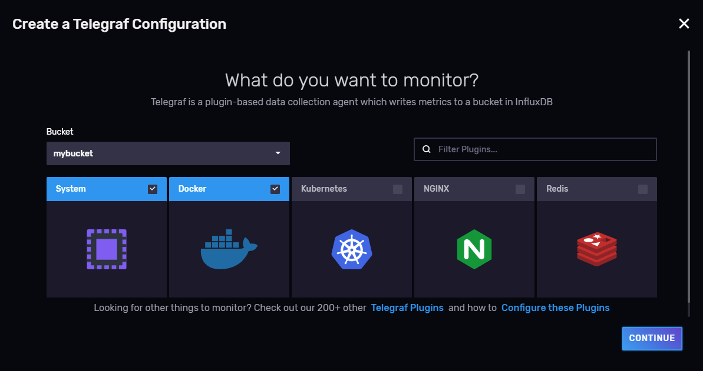
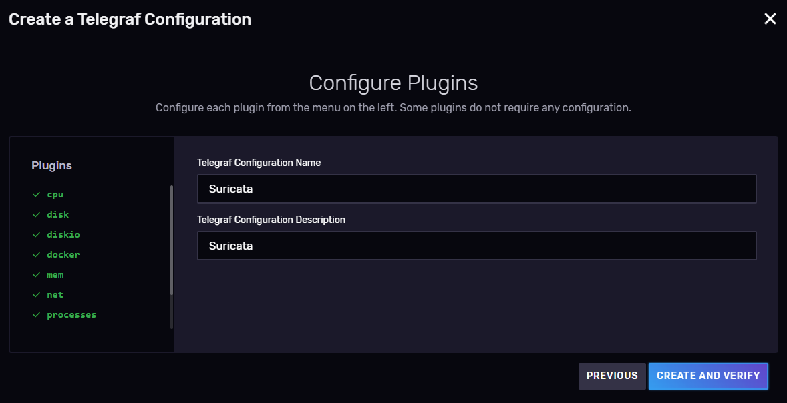
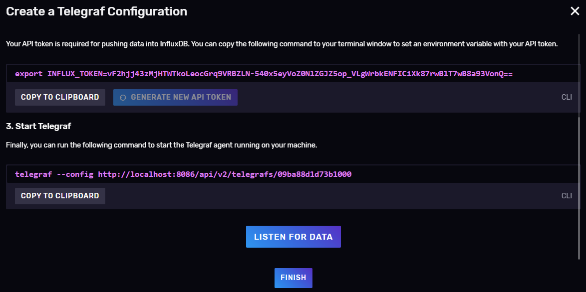
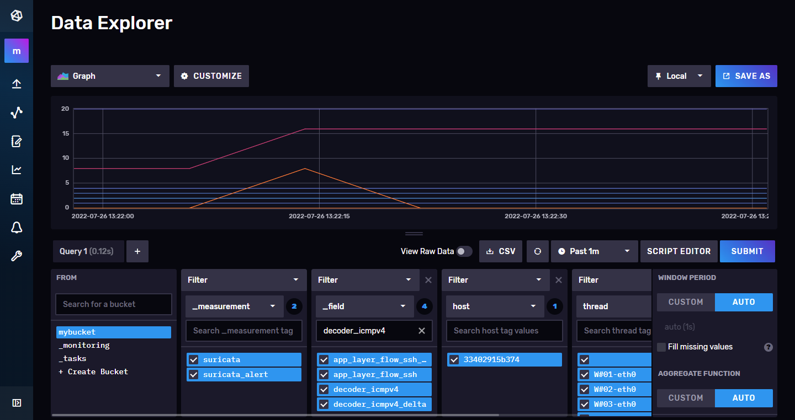

# Design and implementation of a trustworthy industrial log monitoring system based on Hyperledger Fabric Blockchain

The aim of the project is to design and implement a log monitoring system that guarantees the immutablity of the logs. To that end, the system will make use of the Hyerledger Fabric Blockchain, as well as many other services.

This repository includes detailed information about the design and implementation of the log monitoring system, as well as the sourcecode of the project and a useguide.

> **Note**
> 
> 🛠️ This repository is in developement stage at the moment 🛠️

Developed and supported by [sfl0r3nz05](https://github.com/sfl0r3nz05) and [gomezander](https://github.com/gomezander).


## Contents
- [System Design]
- [System Implementation]
- [Setting Up]

- [Design and implementation of a trustworthy industrial log monitoring system based on Hyperledger Fabric Blockchain](#service-with-suricata-telegraf-influxdb-and-grafana)
  - [Versions](#versions)
  - [Pre-requisites](#pre-requisites)
  - [Getting Started](#getting-started)
    - [Configure suricata](#configure-suricata)
      - [Configure suricata.yaml](#configure-suricatayaml)
        - [Global stats configuration](#global-stats-configuration)
        - [Eve-log configuration](#eve-log-configuration)
    - [Configure telegraf](#configure-telegraf)
      - [configure telegraf.conf](#configure-telegrafconf)
        - [Global tags configuration](#global-tags-configuration)
        - [Input configuration](#input-configuration)
        - [Output configuration](#output-configuration)
    - [Permissions for Socket shared in volume](#permissions-for-socket-shared-in-volume)
    - [Configure InfluxDB](#configure-influxdb)
  - [How to Start](#how-to-start)
    - [Mapped Ports](#mapped-ports)
    - [Grafana](#grafana)
      - [Data source on Grafana](#data-source-on-grafana)
    - [InfluxDB](#influxdb)
      - [Web Interface](#web-interface)
  - [Troubleshootings](#troubleshootings)
    - [Test socket on suricata container](#test-socket-on-suricata-container)
    - [Test socket on telegraf container](#test-socket-on-telegraf-container)

## Versions

- Suricata:          6.0.6
- InfluxDB:          2.3.0
- Telegraf (StatsD): 1.23.2
- Postgres:          14.2.0
- Grafana:           8.4.3

## Pre-requisites

- Download and install the latest available version of [Docker](https://docs.docker.com/engine/install/ubuntu/)
- Download and install the latest available version of [Docker Compose](https://docs.docker.com/compose/install/)
- Configure [Docker as non root](https://docs.docker.com/engine/install/linux-postinstall/)

## Getting Started

### Configure suricata

*The following settings have already been made, so they should be followed in case new rules are added or updated.*

1. Download rules from the community:

    ```bash
    wget http://rules.emergingthreats.net/open/suricata/emerging.rules.tar.gz
    ```

2. Unzip the rules

    ```bash
    tar zxvf emerging.rules.tar.gz
    ```

3. Move `~/rules` folder to `~/composer-suri-tele-infl-graf/suricata/`

    ```bash
    sudo mv rules /var/lib/suricata/
    ```

4. Configure `docker-compose.yaml` file, adding next line as volume:

    ```bash
      - ./suricata/rules:/var/lib/suricata/rules
    ```

5. Create `my-rules` file:

    ```bash
      - vim ~/composer-suri-tele-infl-graf/suricata/rules/my-rules
    ```

6. Add next rules:

    1. Ping detection

        ```bash
          alert icmp any any -> $HOME_NET any (msg:"ICMP connection attempt"; sid:1000002; rev:1;)
        ```

    2. SSH connections detection

        ```bash
          alert tcp any any -> $HOME_NET 22 (msg:"SSH connection attempt"; sid:1000003; rev:1;)
        ```

    3. Detects excessive packet forwarding to port 80.

        ```bash
          alert tcp any any -> $HOME_NET 80 (msg:"DDoS Unusually fast port 80 SYN packets outbound, Potential DDoS"; flags: S,12; threshold: type both, track by_dst, count 500, seconds 5; classtype:misc-activity; sid:6;)
        ```

7. Edit suricata configuration file:

    ```bash
    sudo vim ~/composer-suri-tele-infl-graf/suricata/suricata.yaml
    ```

8. Modify `default-rule-path` adding `path`, `community rules` and `personal rules`:

    ```bash
    default-rule-path: /var/lib/suricata/rules

    rule-files:
  
        - emerging-exploit.rules
  
        - my-rules
    ```

#### Configure suricata.yaml

##### Global stats configuration

```bash
# Global stats configuration
stats:
  enabled: yes
  # The interval field (in seconds) controls the interval at
  # which stats are updated in the log.
  interval: 8
  # Add decode events to stats.
  decoder-events: true
  # Decoder event prefix in stats. Has been 'decoder' before, but that leads
  # to missing events in the eve.stats records. See issue #2225.
  decoder-events-prefix: "decoder.event"
  # Add stream events as stats.
  stream-events: false
```

##### Eve-log configuration

```bash
- eve-log:
    enabled: yes
    filetype: unix_stream
    filename: /var/run/suricata/suricata-command.socket
    types:
      - stats:
          totals: yes       # stats for all threads merged together
          threads: yes       # per thread stats
          deltas: yes        # include delta values
      - alert:
         enabled: yes
         payload: yes
         metadata: yes
```

### Configure telegraf

#### configure telegraf.conf

##### Global tags configuration

```bash
# Global tags can be specified here in key="value" format.
[global_tags]
  # dc = "us-east-1" # will tag all metrics with dc=us-east-1
  # rack = "1a"
  ## Environment variables can be used as tags, and throughout the config file
  # user = "$USER"
```

##### Input configuration

```bash
# Suricata stats and alerts plugin
[[inputs.suricata]]
  ## Data sink for Suricata stats and alerts logs
  # This is expected to be a filename of a
  # unix socket to be created for listening.
  source = "/var/run/suricata-command.socket"

  # Delimiter for flattening field keys, e.g. subitem "alert" of "detect"
  # becomes "detect_alert" when delimiter is "_".
  delimiter = "_"

  ## Detect alert logs
  alerts = true
```

##### Output configuration

```bash
# # Configuration for sending metrics to InfluxDB
[[outputs.influxdb_v2]]
  ## The URLs of the InfluxDB cluster nodes.
  ##
  ## Multiple URLs can be specified for a single cluster, only ONE of the
  ## urls will be written to each interval.
  ##   ex: urls = ["https://us-west-2-1.aws.cloud2.influxdata.com"]
  urls = ["http://influxdb:8086"]

  ## Token for authentication.
  token = "$INFLUXDB_INIT_ADMIN_TOKEN"

  ## Organization is the name of the organization you wish to write to; must exist.
  organization = "$INFLUXDB_INIT_ORG"

  ## Destination bucket to write into.
  bucket = "$INFLUXDB_INIT_BUCKET"
```

Environmental variables must be updated on: ~/composer-suri-tele-infl-graf

```bash
INFLUXDB_INIT_ORG=myorganization
INFLUXDB_INIT_BUCKET=mybucket
INFLUXDB_INIT_ADMIN_TOKEN=vF2hjj43zMjHTWTkoLeocGrq9VRBZLN-540x5eyVoZ0NlZGJZ5op_VLgWrbkENFICiXk87rwB1T7wB8a93VonQ==
```

### Permissions for Socket shared in volume

1. Give permissions to the shared volume for sockets

    ```bash
    sudo chmod 777 /var/run/shared
    ```

2. Add aditional volume in suricata docker-compose service:

    ```bash
      - /var/run/shared:/var/run/suricata/
    ```

3. Add aditional volume in telegraf docker-compose service:

    ```bash
      - /var/run/shared:/var/run/
    ```

### Configure InfluxDB

```bash
user: admin
password: admin123456
```

1. Verify the bucket creation

   

2. Associate telegraf agent to this bucket

   

3. Configure plugins

   

4. Collect token and press *Listen for Data* Button

   

5. Selects metrics and configure dashboard

   

## How to Start

In order to start the service the first time launch:

1. Start influxdb:

    ```bash
    COMPOSE_PROFILES=influx docker compose up -d
    ```

2. Configure influxDB as section [Configure InfluxDB](https://github.com/gomezander/composer-suri-tele-infl-graf/tree/dev#configure-influxdb)

3. Start telegraf:

    ```bash
    COMPOSE_PROFILES=telegraf docker compose up -d
    ```
    
    You can replace `COMPOSE_PROFILES=grafana,telegraf` with the desired profiles to launch, you can launch only InfluxDB (default with no profiles).

    To stop the service launch:

    ```bash
    COMPOSE_PROFILES=grafana,telegraf docker compose down
    ```

    Make sure that telegraf creates the socket to communicate with suricata correctly, by checking the logs os the container.

    ```bash
    docker compose logs
    ```
    
    It is important that the telegraf container is started before the suricata container, otherwise suricata won't be able to connect to the socket.

4. Start suricata

    ```bash
    COMPOSE_PROFILES=suricata docker compose up -d
    ```

    Once again make sure that suricata connects to the socket properly.

    ```bash
    docker compose logs
    ```
    
5. Configure InfluxDB datasource from web interface

    InfluxDB data source is automatically provisioned with new Flux language support flag.

    Open <http://localhost:8086>

    ```bash
    Username: admin
    Password: admin123456
    Port: 8086
    ```

    Once configured the telegraf agent as section [Configure InfluxDB](https://github.com/gomezander/composer-suri-tele-infl-graf/tree/dev#configure-influxdb) copy the     token and paste it in telegraf.env inside the telegraf folder.

    Start telegraf container and restart suricata container.

    ```bash
      COMPOSE_PROFILES=telegraf,suricata docker compose up -d
    ```

6. Check that suricata data is received in InfluxDB

    Make a new dashboard and select the suricata alerts you want to see.
    


7. Start Grafana

    ```bash
      COMPOSE_PROFILES=grafana docker compose up -d
    ```


    Open <http://localhost:3000>

    ```bash
    Username: admin
    Password: admin
    ```

    #### Data source on Grafana

    Check that InfluxDB datasource is added in Configuration --> Data Sources

    Add a new panel and check that data is being received. You can use the examples provided by Grafana.
    
    
    Create a neew dashboard and select the data you want to see by making a Flux query.
    You can copy the query from InfluxDB dashboard, selecting **Script Editor**.
    
    In this case, we wanted to see the ssh alerts of suricata.
    
    
    
    
    

    
## Final result in Grafana


### Mapped Ports

```
Host		Container		Service

3000		3000			grafana
8086		8086		  	influxdb
8125		8125			statsd
```


## Troubleshootings

### Test socket on suricata container

1. Use the tool:

```bash
root@dd39f97b4f3f:/suricata/python# suricatasc
Unable to connect to socket @e_localstatedir@/suricata-command.socket: [Errno 2] No such file or directory
root@dd39f97b4f3f:/suricata/python# suricatasc /var/run/suricata-command.socket
Command list: shutdown, command-list, help, version, uptime, running-mode, capture-mode, conf-get, dump-counters, reload-rules, ruleset-reload-rules, ruleset-reload-nonblocking, ruleset-reload-time, ruleset-stats, ruleset-failed-rules, register-tenant-handler, unregister-tenant-handler, register-tenant, reload-tenant, unregister-tenant, add-hostbit, remove-hostbit, list-hostbit, reopen-log-files, memcap-set, memcap-show, memcap-list, dataset-add, dataset-remove, iface-stat, iface-list, iface-bypassed-stat, ebpf-bypassed-stat, quit
>>> iface-list
Success:
{
    "count": 1,
    "ifaces": [
        "eth0"
    ]
}
>>> iface-stat eth0
Success:
{
    "bypassed": 0,
    "drop": 11284,
    "invalid-checksums": 2,
    "pkts": 183099
}
```

### Test socket on telegraf container

1. Update pakage manager: `apt update`
2. Install git: `apt install git`
3. Clone suricata repo: `git clone https://github.com/OISF/suricata.git`
4. Access to directory: `cd /suricata/python/suricata/config/`
5. Rename file: `mv defaults.py.in defaults.py`
6. Install python: `apt install -y build-essential libssl-dev libffi-dev python3-dev`
7. Access to directory: `cd /suricata/python`
8. Install tool `python3 setup.py install`
9. Use the tool:

```bash
root@dd39f97b4f3f:/suricata/python# suricatasc
Unable to connect to socket @e_localstatedir@/suricata-command.socket: [Errno 2] No such file or directory
root@dd39f97b4f3f:/suricata/python# suricatasc /var/run/suricata-command.socket
Command list: shutdown, command-list, help, version, uptime, running-mode, capture-mode, conf-get, dump-counters, reload-rules, ruleset-reload-rules, ruleset-reload-nonblocking, ruleset-reload-time, ruleset-stats, ruleset-failed-rules, register-tenant-handler, unregister-tenant-handler, register-tenant, reload-tenant, unregister-tenant, add-hostbit, remove-hostbit, list-hostbit, reopen-log-files, memcap-set, memcap-show, memcap-list, dataset-add, dataset-remove, iface-stat, iface-list, iface-bypassed-stat, ebpf-bypassed-stat, quit
>>> iface-list
Success:
{
    "count": 1,
    "ifaces": [
        "eth0"
    ]
}
>>> iface-stat eth0
Success:
{
    "bypassed": 0,
    "drop": 11284,
    "invalid-checksums": 2,
    "pkts": 183099
}
```
